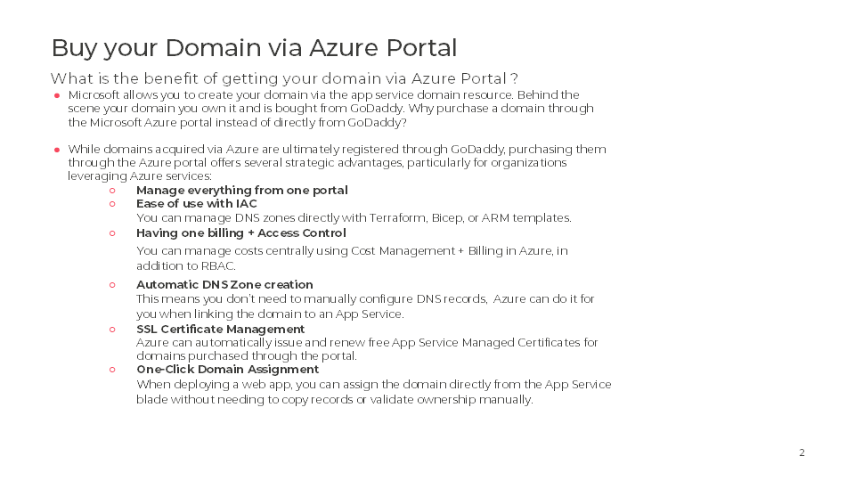
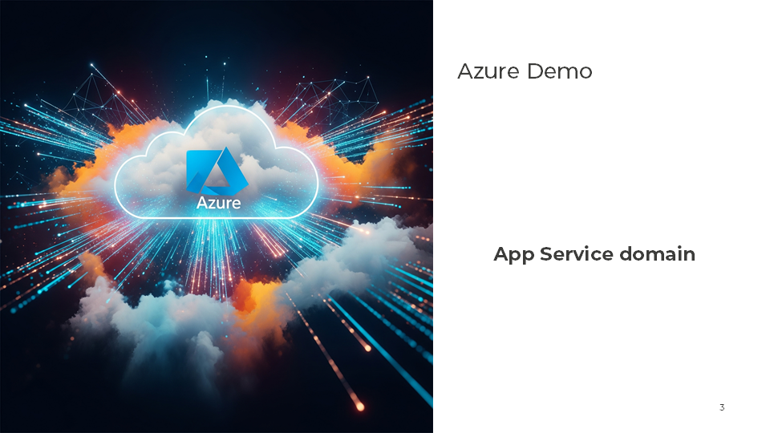
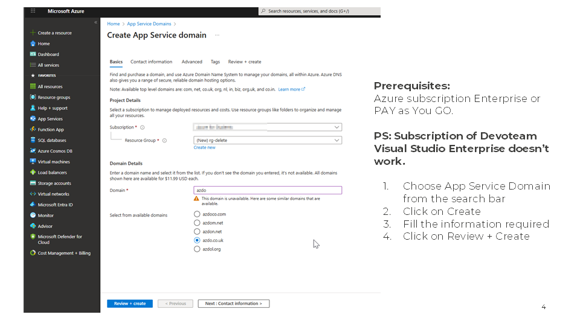
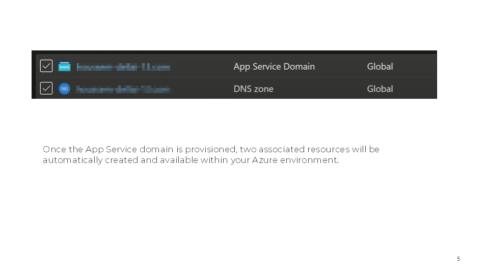

# App-Service-Domain: Managing Domains the Azure Way
Did you know? App Service Domain is one of Azure’s older features, yet many cloud professionals might not be familiar with it. While it doesn’t get much attention today, it still plays a role in simplifying domain management on Azure.

This document aims to highlight this resource, which allows you to purchase, configure, and manage your domain alongside your Azure resources, all in one place. Whether you're deploying web apps or setting up secure endpoints, App Service Domain simplifies domain management without needing to leave the Azure ecosystem.

## Buy your domain via Azure Portal

